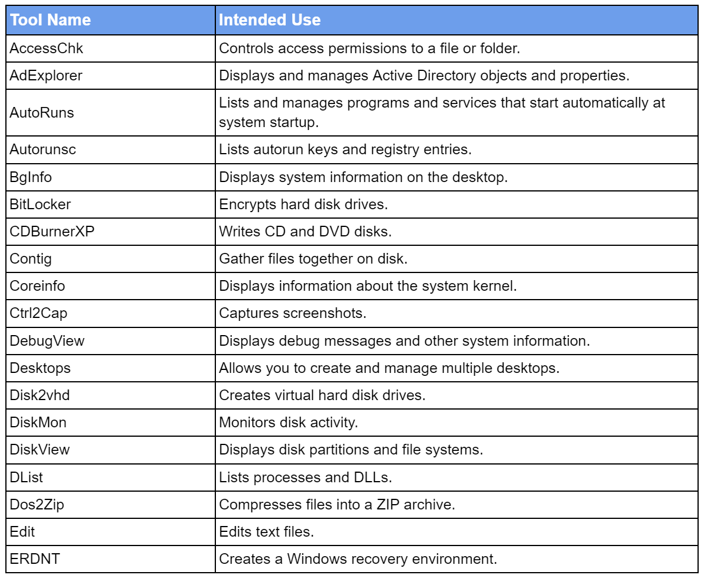
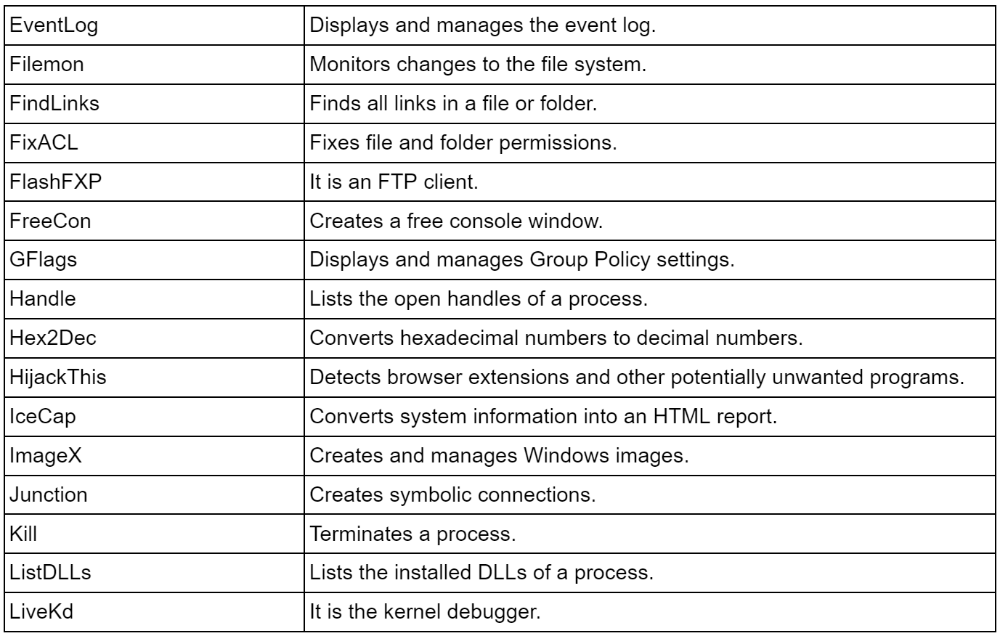
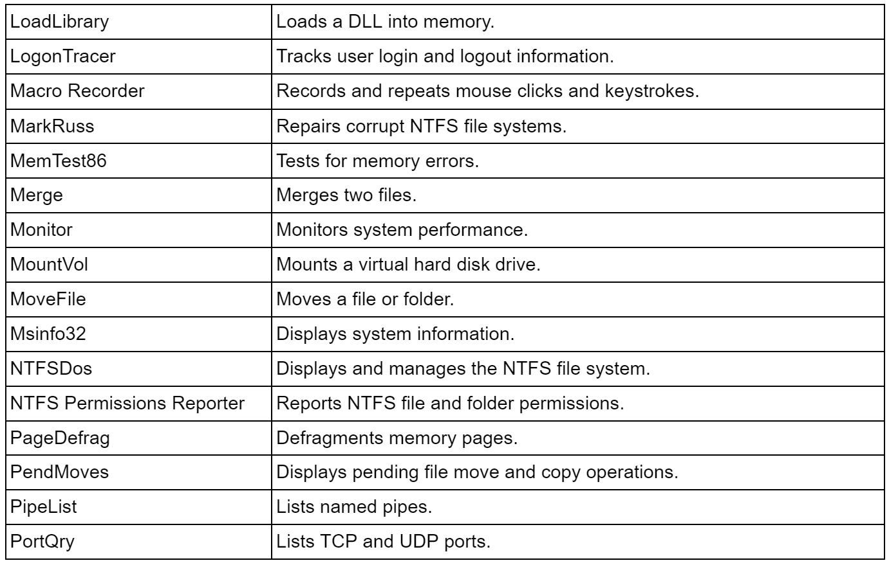
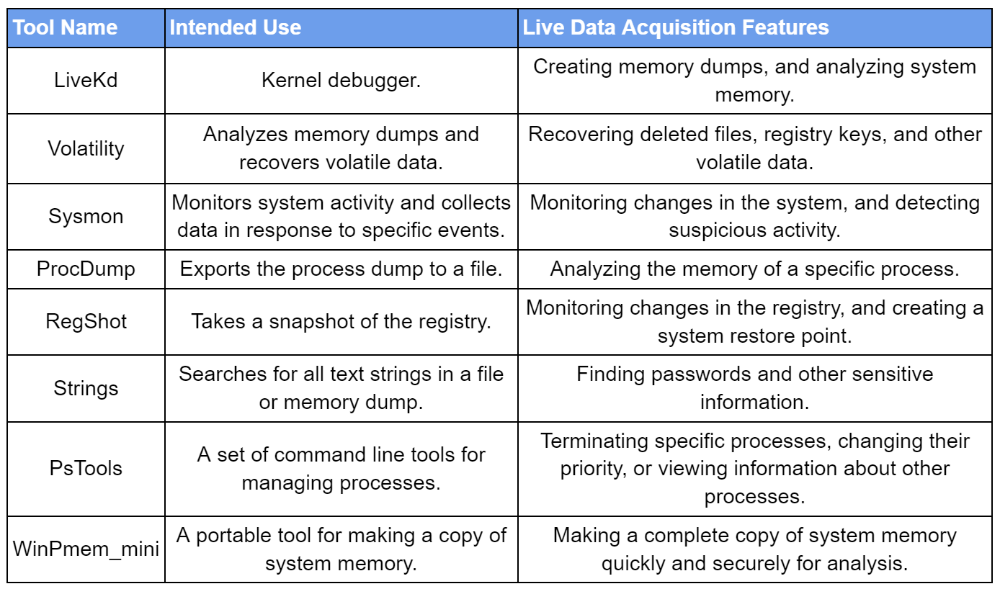

## Data Recovery from Mechanical Disks (HDDs)
### Physical Structure and Recovery Challenges

HDDs have moving read/write heads that write to and read from magnetic platters. Data loss can occur due to physical damage (platter scratches, motor failures), logical errors (accidental deletion, formatting), or software faults.
In cases of physical damage, recovery must be performed in cleanroom environments using specialized equipment.

#### Recovery Software and Hardware
Software: Tools like TestDisk, Recuva, R-Studio, and EaseUS Data Recovery Wizard can be used to recover accidentally deleted files, corrupted partitions, or formatted disks.
Hardware: For recovery operations, industry imaging tools like DeepSpar Disk Imager, cleanroom conditions, and micro-surgical tools may be required.

## Data Recovery from Solid-State Drives (SSDs)
### Physical Structure and Recovery Challenges

SSDs are electronic devices that record data onto NAND flash memory chips. Data loss may occur due to NAND wear, electronic failures, or logical errors.

The TRIM command helps maintain the performance and lifespan of SSDs because SSDs store data in flash memory cells, which have a limited number of write cycles. The TRIM command informs the operating system which data blocks are no longer in use, allowing the SSD to clear marks from these blocks. This reduces the time spent on finding free space and noticeably improves writing performance. Moreover, it eliminates the need to rewrite over unused data blocks, extending the SSD's lifespan. Finally, when data is deleted, there is no need for physical erasure on the SSD, speeding up the file deletion process.

However, one disadvantage of this advantage is that the activation of the TRIM command allows new data to be quickly written over deleted data, complicating the recovery process.

#### Recovery Software and Hardware

Software: Recovery from SSDs requires software that uses specialized algorithms. For example, Stellar Data Recovery and Ontrack EasyRecovery consider the characteristics of NAND flash memory and the effects of the TRIM command.

Hardware: SSD recovery processes may involve repairing electronic components or directly reading NAND flash memory chips. Therefore, specialized hardware such as NAND readers, memory chip removers, and electronic repair kits may be necessary.


## Risk of Data Loss
When the TRIM command is active in SSDs, recovering deleted data can become nearly impossible. In contrast, in HDDs, deleted data is generally recoverable unless new data has been written over it.

## FAT32
FAT32 stands for "File Allocation Table 32" and is one of the older file systems. It remains popular due to its wide compatibility with a range of devices. Introduced in 1996 with Windows 95 OSR2, FAT32 replaced FAT16 and was designed to support larger disk partitions and files. The technical structure and operating principles of FAT32 encompass several key features in the data storage and access processes.

## NTFS File System
NTFS stands for "New Technology File System" and was developed by Microsoft for Windows NT and later versions. With its advanced features and performance, it is the preferred file system in modern Windows environments. Focusing on performance, security, and data integrity, NTFS has a more complex structure than FAT32, designed to meet the advanced needs of modern computer systems.


## exFAT File System
exFAT (Extended File Allocation Table) was developed by Microsoft specifically for portable storage devices like flash drives and SD cards. It was designed to overcome the limitations of FAT32 and incorporate some of the features NTFS offers in portable storage environments. exFAT supports large files, offers better storage management, and is compatible with a wider range of devices.


## Live Data Acquisition Tools









#### WinPmem
WinPmem is a useful, small, and installation-free Memory Dump tool. It is available at the following address:

WinPmem : https://github.com/Velocidex/WinPmem/releases
```bash
Winpmem_mini_x64_rc2.exe memdump.raw
```

#### FTK Imager
FTK Imager is a useful tool for taking images of both the drives connected to the system and the memory on Windows systems. The FTK Imager tool installation file can be downloaded from the following address:

FTK Imager : https://go.exterro.com/l/43312/2023-05-03/fc4b78

#### Volatility
Volatility is a powerful tool for analyzing both Linux and Windows memory images. Developed in Python, it can be used on almost any system with Python.

To install Volatility on Windows (assuming Python 3.11 is installed on the system), first download Volatility from the address below:

Volatility : https://github.com/volatilityfoundation/volatility3/releases
Volatility Plugins (for Windows) : https://github.com/volatilityfoundation/volatility/wiki/Command-Reference

To complete the installation of Volatility, download the “Microsoft C++ Build Tools”. It is available at the following address:

Microsoft C++ Build Tools : https://visualstudio.microsoft.com/visual-cpp-build-tools/

The Volatility installation requires a few more installations. One of them is the “Snappy” package for Python. There are different versions of this package available in many repositories, but the versions except the one downloaded from the link below do not work:

Python Snappy : https://download.lfd.uci.edu/pythonlibs/archived/python_snappy-0.6.1-cp311-cp311-win_amd64.whl
```bash
pip install .\python_snappy-0.6.1-cpp311-cpp311-win_amd64.whl  / pip install .\python_snappy-0.7.1-py3-none-any.whl
pip install -r .\requirements.txt
python .\vol.py / python.exe .\vol.py -h
python .\vol.py -f memdump.mem windows.info.Info
```

## Dynamic Acquisition on Windows

](DA.png)

Various system management and monitoring tools specifically designed for the Windows operating system facilitate dynamic data collection. These tools track system logs, performance metrics, and network activity. One notable example is the “ SysInternals Suite” , which is distributed free of charge by Microsoft. This suite contains a variety of tools, several of which are particularly useful for dynamic data acquisition. Below are some of these tools:

Process Explorer
AutoRuns
Regedit
Security Tools


## Data Acquisition Methods

#### Bit-Level Copy
An exact copy of physical or logical disks is made at the bit level (as a disk image). This method allows copying all data, configuration files, and hidden partitions on the disk.
The copy process transfers data from a source to a destination. The source and destination can be various data storage media such as hard disk drives, memory devices, or files.
A bit-level copy operation copies each bit of data individually. A unit of data can contain multiple bits, such as a byte (8 bits), a word (16 bits) or a dword (32 bits).

Bit-level copying can be performed using various methods. The most common methods are:

Sector Copy: This method copies each sector (512 bytes) on a disk one by one.
File Copy: This method copies all data in a file.
Memory Copy: This method copies all data in the memory of a computer system.


Errors can occur during the bit-level copy process. Error detection algorithms are used to detect and correct these errors.

## How to Recover Deleted Files?
Imaging Process: The first step is to acquire an image of the target disk or partition to minimize the risk of damaging the original media. “dd”, “dc3dd” and others can be used to capture disk images.

Selecting Tools: Various open-source and commercial tools are available for recovering deleted files. The Sleuth Kit (TSK), TestDisk, Photorec, Foremost, or tools specific to disk types (e.g., ext3grep) are commonly used in Linux for recovering deleted files.
File System Analysis: Tools scan the disk image to find deleted files, examining file system tables and allocation markings.
Detecting and Recovering Deleted Files: When deleted files are located, recovery tools can restore them to a secure location for analysis. This process depends on whether the physical data of the file still exists on the disk and if it has been overwritten.


Data Recovery from a Disk in "Ext3" Format
“Ext3grep” is a file recovery tool designed specifically for Ext3 file systems used in Linux operating systems. This tool can recover deleted files, directories, and their contents based on parameters such as specific timestamps, file names, or file types. During the file recovery process, “ext3grep” searches for deleted data and restores found files.
```bash
Install the “ext3grep” package.                    
apt install ext3grep
#Capture an image of the disk where deleted files will be recovered.                   
dd if=/dev/sdb1 of=/root/forensic.dd status=progress bs=8k                    
uname -a                 
df -hT
#Use the “--dump-name” parameter to view all files in the image.         
ext3grep --dump-name forensic.dd
#Use the “--restore-all” parameter to recover all files from the image.
ext3grep --restore-all forensic.dd
```
dd command for disk content conversion
```bash
dd if=<source> of=<destination> bs=<block_size> status=progress
#To capture an image of a hard disk partition (such as /dev/sdb1) and save it to a file named "disk_image.img," you can use the following command:
sudo dd if=/dev/sdb1 of=/path/to/disk_image.img bs=4M status=progress
#Directly mounting an image provides access to files within the file system. This should be done for read-only purposes, ensuring the integrity of the image.
dd if=/dev/sda1 of=/tmp/sda1.img bs=4M status=progress
mount -o ro /tmp/sda1.img /mnt/image
```


### /etc/passwd
This file contains basic details about user accounts on the system such as username, UID, GID, home directory, and default shell to facilitate the configuration and definition of user accounts.

Detecting Unauthorized User Accounts: The /etc/passwd file contains all the user accounts defined on the system and helps identify which users have created accounts. If a malicious user has been added, or a user account has been suspiciously changed, this could be an indication of a security breach.

Monitoring User Activities on the System: Operations performed via user accounts help understand system activities and potential malicious usage.

User Environment and Behavior: /etc/passwd provides information about user home directories and default shells. This can be used to understand how users interact with the system and what activities they perform.


Each line in the "/etc/passwd" file has the following structure:
```bash                     
username:x:user_id:group_id:real_name:user_home_directory:user_shell
```
- username: The name used by the user to log into the system.
- x: Placeholder where the encrypted password used to be stored in earlier times. For security reasons, it is mostly represented by “x” now, with actual encrypted passwords stored in the "/etc/shadow" file.
- user_id (UID): Unique identifier for each user. For the “root” user, this value is typically "0".
- group_id (GID): Number of the user's primary group. User groups and permissions are managed using this number.
- real_name: User's real name or description. This field is optional and can contain additional information about the user.
- user_home_directory: Path to the user's home directory. When a user logs in, this directory is automatically set as the working directory.
- user_shell: Path to the user's command-line shell. This determines the command-line interface the user will use when accessing the system.

```bash
username:password_hash:time:minimum:maximum:warning:inactivity:expiration_date
```
- username: The name of the user on the system, matching the contents of the "/etc/passwd" file.
- password_hash: The user's encrypted password. This is not the actual password, but a hash value calculated using a hash function.
- time: Total number of days since 1 January 1970 when the password was last changed (Unix timestamp).
- minimum: Minimum number of days a user must wait before changing their password.
- maximum: Maximum number of days a user can keep the password before changing it.
- warning: Number of days before password expiry when the user is warned.
- inactivity: Number of days after password expiry before the account becomes inactive.
- expiration_date: The date on which the account will expire, expressed as the number of days since 1 January 1970.

#### /etc/sudoers
It defines which commands users or groups can execute with "root" privileges using the "sudo" command. Usually, it is examined to understand authorization policies on the system and identify potentially unauthorized sudo authorizations.
Examining Authorization Policies: Understanding authorization levels and user permissions on the system is critical to identifying security breaches.
Detecting Unauthorized "sudo" Authorizations: Use it to investigate added or modified authorizations that could affect control levels on the system.

#### /etc/crontab
It defines scheduled tasks (cron jobs) on the system and contains commands and scripts that will automatically run at specific times.

/etc/crontab is essential for detecting automatically executed malicious or suspicious scripts and commands. Attackers often use scheduled tasks to maintain long-term access to the system or automate malicious activities.

Detecting Malicious Automated Tasks: Malicious scripts or commands added by attackers may be stored in this file.

Understanding Automated Activities on the System: Detailed analysis of automated processes on the system is vital for tracing attacker traces and understanding changes made to the system.
Malware and Backdoors: Attackers may add hidden tasks to the "/etc/crontab" file to maintain persistence on the system and regularly engage in malicious activities. Therefore, suspicious entries in the file can indicate the presence of malware or backdoors.

#### .ssh/authorized_keys
In digital forensics, analyzing the "~/.ssh/authorized_keys" file plays a critical role in detecting potential security vulnerabilities, unauthorized accesses, or attempted attacks. This file, located in the user's "home" directory, reveals which users and which keys are authorized for remote access.

The "authorized_keys" file contains public keys authorized for remote SSH access. Adding a public key to a user's "~/.ssh/authorized_keys" file allows the corresponding private key owner to access the user account without using a password.

Unauthorized Access Detection: The ".ssh/authorized_keys" file contains public keys granted SSH access to the user's system. If an unexpected or unidentified public key is added to this file, it may indicate unauthorized access or an attempt to gain access by an unauthorized individual.

System Security Assessment: The number and type of keys in the file can provide insights into the system's security status. For example, keys using weak or outdated algorithms may indicate potential security risks.

Misuse or Malicious Activities: Attackers can gain and maintain remote access by adding their public keys to compromised user accounts. Such modifications can be considered evidence of abuse or malicious activities.

#### .bashrc File
User Customizations: Users personalize workflows by defining aliases, functions, and environment variables. These customizations can provide clues about how users interact with the system.

Automatically Executed Commands: ".bashrc" may contain commands set to execute automatically. This is crucial in digital forensics to identify potential automatic actions or traces left by the user on the system.

Malicious Actions: There are instances where users or attackers may modify the ".bashrc" file to leave a lasting impact on the system. For example, commands for initiating malicious software at startup may be added.

Access and Modification Dates: The last access and modification dates of the ".bashrc" file can be used to create a timeline of user activities, which is particularly useful in determining when a security breach occurred.

In conclusion, the ".bashrc" file is a critical component in Linux forensic analysis for understanding user behaviors and system interactions. Its contents provide deep insights into forensic investigations, revealing how the system is used and potentially exposing malicious activities.


Some memory dump tools that can be used for memory forensics on Windows systems include:

- WinDbg (Windows Debugger)
It is a tool developed by Microsoft that offers in-depth debugging and analysis capabilities in the Windows operating system. It provides extensive features for opening and analyzing memory dump files.

- Volatility Framework
An open-source memory analysis framework whose plugins can examine Windows memory dump files and provide a variety of analysis options to extract OS-specific artifacts.

- Magnet RAM Capture
It is a fast and efficient memory dump capture tool. Thanks to its simple interface, it can be easily used by all user levels and can quickly capture the contents of RAM.

- Belkasoft Evidence Center
It is a comprehensive digital forensic tool that can analyze a wide range of digital artifacts, including memory dump files.

- AccessData FTK Imager
Known for its disk imaging and analysis capabilities, it can also view memory dump files and perform simple analysis.

- Rekall (previously Volatility Fork)
An open source and advanced memory forensics framework branched off from Volatility, known for its more advanced analysis capabilities.

- MemDump
It is a simple command-line tool that can quickly dump the contents of RAM to disk in raw format.

There are several reasons why memory dumping is critical to forensic analysis. Digital forensics is about collecting, preserving, analyzing, and reporting data from digital devices for forensic analysis. When doing so, taking a memory dump provides a frozen snapshot of the current state of the system that contains important information on several fronts. The information includes:

volatility3 command

```bash
#To view the operating system, version, and other basic information from the memory dump file:                
python vol.py -f <memory_dump> windows.info
                 
#To get user account hashes from the SAM database:                 
python vol.py -f <memory_dump> windows.hashdump
                
#To display a list of processes running on the system:                  
python vol.py -f <memory_dump> windows.pslist
                   
#To list DLLs loaded by running processes:
python vol.py -f <memory_dump> windows.dlllist
                  
#Note : It's important to see what libraries processes are using.
#To look for memory segments containing potentially malicious code:                   
python vol.py -f <memory_dump> windows.malfind
               
#Displays the tree structure of processes and shows parent/child relationships:                   
python vol.py -f <memory_dump> windows.pstree

                   
#To scan and list the drivers on the system:                  
python vol.py -f <memory_dump> windows.driverscan
            
#To list the driver modules installed on the system                 
python vol.py -f <memory_dump> windows.drivermodule
                  
#It scans all processes in memory, unlike pslist, it also lists processes that have terminated but still have traces in memory:                 
python vol.py -f <memory_dump> windows.psscan
              
#Lists the command line arguments of running processes. This can be used to understand how processes are started.                
python vol.py -f <memory_dump> windows.cmdline
                
#To list registry hives:                  
python vol.py -f <memory_dump> windows.registry.hivelist
                  
#To perform a scan of the registry hives:
python vol.py -f <memory_dump> windows.registry.hivescan
                 
#To list installed Windows kernel modules:                  
python vol.py -f <memory_dump> windows.modules
               
#To list all network connections for all processes:                  
python vol.py -f <memory_dump> windows.netscan
                 
#Allows you to scan Windows memory dumps using YARA rules:                 
python vol.py -f <memory_dump> yarascan.YaraScan --yara-rules "/path/to/yara_rules.yar"
             
To learn more about Volatility 3, you can visit: https://volatility3.readthedocs.io/en/latest/basics.html
Memory Dump Analysis with Volatility 3
```

Example used cases:

```bash
python.exe .\vol.py -f LD-DC01-memdump.mem windows.info

#List of Processes
#You can view a list of running processes from the memory dump:    
python.exe .\vol.py -f LD-DC01-memdump.mem windows.pslist


#Running Process Arguments 
#You can list running processes' command line arguments in the dump:                  
python.exe .\vol.py -f LD-DC01-memdump.mem windows.cmdline


#DLL List
#You can also list DLLs loaded by running processes:               
python.exe .\vol.py -f LD-DC01-memdump.mem windows.dlllist

#yara.yara scan
python .\volatility3-2.5.2\vol.py -f .\fr01.mem yarascan.YaraScan --yara-file .\net_user_rule.yar
Volatility 3 Framework 2.5.2
```
in .yar file:
```yar
 rule NetUserRule {
    strings:
        $text_string = "net user" 
    condition:
        $text_string
}
```

#### LiME(Linux Memory Extractor)
install:
```bash
git clone https://github.com/504ensicsLabs/LiME.git
cd LiME/src/
make
lsmod | grep -i lime

df -h
free -m
cd tools/LiME/src/
ls -l lime*.ko
# This command loads the LiME kernel module named 'lime-6.5.0-25-generic.ko' into the Linux kernel and initiates a memory dump
insmod lime-6.5.0-25-generic.ko "path=/var/dumps/ubuntu-memdump.lime format=lime"
ls /var/dumps/
du -sch /var/dumps/ubuntu-memdump.lime
```

#### Volatility 
install:
```bash
git clone https://github.com/volatilityfoundation/volatility3.git
cd volatility3/
python3 setup.py build
python3 setup.py install
pip3 install -r requirements-minimal.txt
```


Here are the tools that can be used for memory forensics on Linux systems and their brief descriptions:

- Volatility: An open-source memory analysis framework that supports a wide range of operating systems and memory dump formats. It offers various features such as malware analysis and user activity analysis.

- Rekall (or GRR): Similar to Volatility, Rekall (or GRR) is a memory analysis tool primarily developed by Google with a wide range of analysis features; it is known for its timeline analysis and fast data collection features.

- Redline: A tool for analyzing memory and file systems; offers a user-friendly interface and allows examination of various indicators and artifacts.

- Memoryze for Linux: Another tool used for memory analysis and malware detection; it offers various memory analysis features, but can be more technical to use.

- Linux Memory Grabber: A scripting tool used to take a memory dump from the system and gather the necessary tools for analysis; it can be used swiftly by forensic analysts.


#### Installing dwarf2json on Ubuntu 22.04
Dwarf2json is a utility that processes files containing symbol and type information to produce Volatility3 Intermediate Symbol Format (ISF) JSON output suitable for Linux and MacOS analysis (Go 1.14 or later is required to use it).

You can create a custom ISF file using the "dwarf2json" utility.
```bash
git clone https://github.com/volatilityfoundation/dwarf2json.git
cd dwarf2json/
go build
./dwarf2json --help
```


## What is Network Forensics?
Network forensics is a field of expertise that detects, monitors, and analyzes issues such as criminal or policy violations through network traffic and log data. It is used to identify the source of cyber-attacks, DoS/DDoS, insider threats, and other malicious activities.

### Fundamental Principles of Network Forensics
Data Collection : The continuous monitoring of network traffic allows for data recording for later analysis. This data can be obtained through the use of packet sniffers, log servers, or network monitoring tools. The report should be comprehensive and impartial, as it will be used in legal proceedings.

Investigation: The recorded data is analyzed to provide information about the type of incident, the time, the systems affected, and the potential damage.
- Analysis: The data obtained is analyzed in detail. During this analysis, various network analysis tools and techniques are used.
- Reporting: The findings are compiled into a forensic report. The report should be comprehensive and impartial, as it will be used in legal proceedings.

#### Network Forensics Tools and Techniques

- Packet Analysis Software: Tools such as Wireshark facilitate detailed network traffic analysis.
- SIEM Systems : Security information and event management (SIEM) systems collect and analyze log data, then issue alerts when they detect potential security breaches.
- Anomaly Detection: The process where statistical analysis and machine learning models identify abnormal behaviors and then attempt to detect any potential threats.

WIRESHARK COMMAND:
The following are some of the basic Wireshark display filters that you may need to employ for Network Forensics:

```bash
#Filter by IP Address:                    
ip.src == 192.168.1.1                 
#Filter by target IP Address :                   
ip.dst == 192.168.1.1                  
Shows traffic to a specific destination IP address.
#Filter by TCP/UDP Ports :                  
tcp.port == 80 || udp.port == 53               
Shows TCP port 80 for HTTP traffic and UDP port 53 for DNS queries.
#Filter by protocol :                   
dns                
Shows all DNS protocol traffic.
#Filter by MAC Address :                   
eth.src == 00:11:22:33:44:55                 
Shows traffic from a specific source MAC address.
#Filter by Protocol and Port :                  
tcp.port == 443 && http                
Filters for HTTPS traffic (HTTP protocol over TCP port 443).
#Filter by HTTP “Host” Header :                   
http.host == "www.example.com"                 
Shows HTTP requests made to a specific web server.
#Filter by TCP Connection Establishment :                    
tcp.flags.syn == 1 && tcp.flags.ack == 0                 
Shows connection establishment requests made with TCP SYN packets (without ACK flag).
#Filter by TCP Stream ::                 
tcp.stream eq 5              
Shows all network packets of specific TCP flow number.
 #Filter by Anomalous or Error Packets :                  
tcp.analysis.flags && !tcp.analysis.window_update
```

## Encrypted Traffic Analysis

In Windows, you can execute the following command from the command line:
```powershell           
set SSLKEYLOGFILE=C:\sslkeylog.log
```